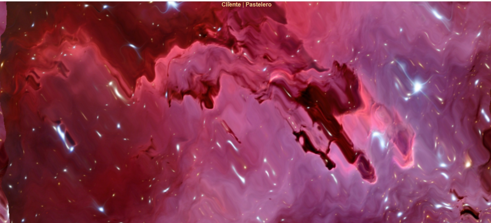
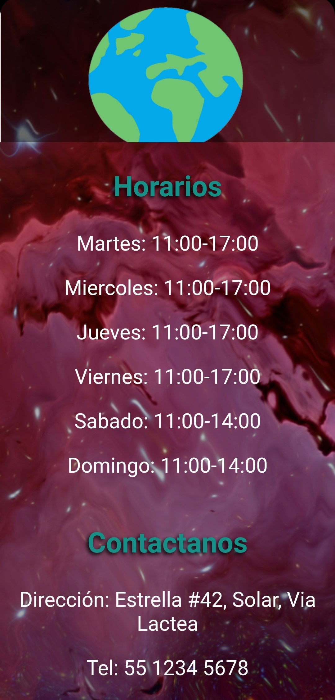

# GalaXica
Visita la pagina [Aqui](https://agreeable-sky-046b3440f.1.azurestaticapps.net/ "Aqui")

## Descripción
Es el proyecto de una pasteleria denominada GalaXica, con dos diferentes rutas: la del pastelero y la del cliente. 
Se pueden realizar pedidos con diferentes combinaciones de sabores y adornos, el pastelero puede visualizar la materia prima restante y los pedidos.

## Visuales
### Vista escritorio
<div>
  
  
  
  
  
  
  
</div>

### Vista celular (responsive)
<div>
  
  
  
  
  
  
</div>


## Instalación
```
npm install
```

### Compila y hot-reloads para el desarrollo
```
npm run serve
```

### Compila y minifica para producción
```
npm run build
```

### Personalizar configuración
See [Configuration Reference](https://cli.vuejs.org/config/).
